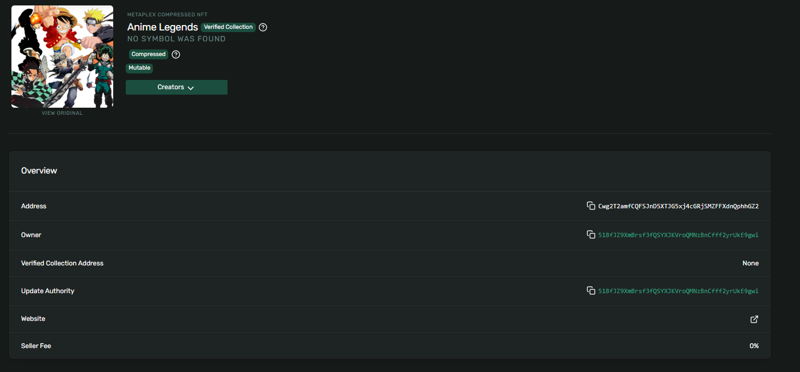
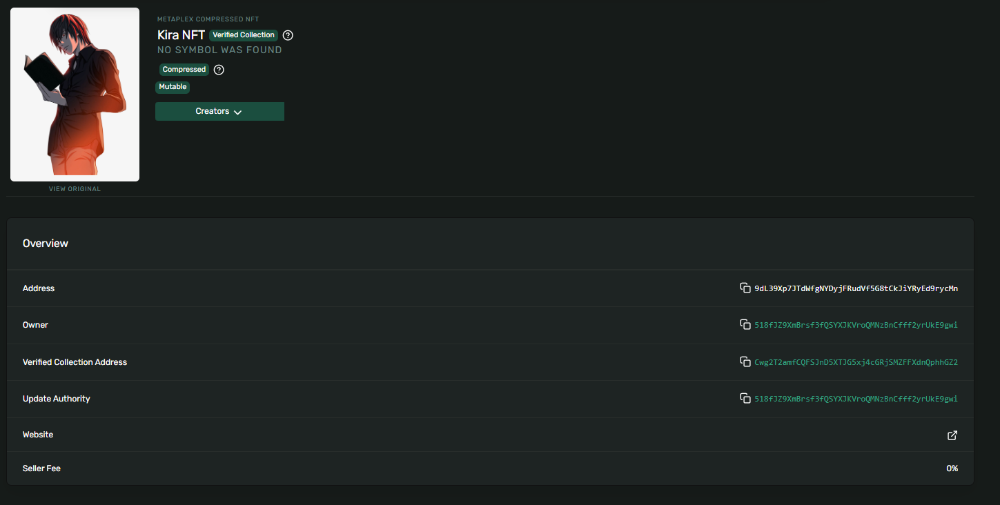
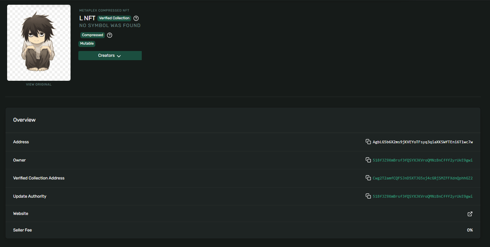
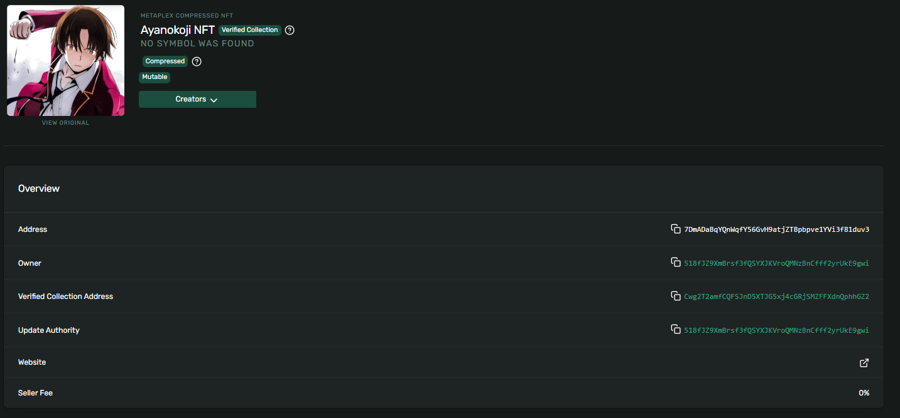
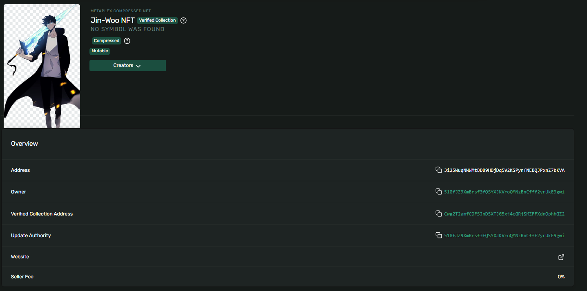

# nft

To install dependencies:

```bash
bun install
```

To run:

```bash
bun run index.ts
```

This project was created using `bun init` in bun v1.2.20. [Bun](https://bun.com) is a fast all-in-one JavaScript runtime.

## Minting an MPL Core NFT on devnet

Environment (optional):

- `DEVNET_RPC` (default: `https://api.devnet.solana.com`)
- `NFT_NAME` (default: `Turbin3 Week 3 NFT`)
- `NFT_URI` (default: placeholder JSON)

First run will create a `wallet.json` (devnet) and request an airdrop. Subsequent runs reuse the same wallet.

Swap with classmates by sending the asset owner address your `wallet.json` public key and asking for theirs. The script outputs the minted asset address and owner.

## Swapping / transferring NFTs on devnet

Transfer a specific asset to a recipient:

```bash
ASSET=<asset_pubkey> \
RECIPIENT=<recipient_pubkey> \
bun run transfer.ts
```

Notes:

- Both sides can transfer assets to each other to complete a swap.
- Verify transactions on Solana Explorer (devnet) using the asset address and recipient address.
- You can set `DEVNET_RPC` to a custom endpoint if needed.

## Example mint output (devnet)

```
Created Collection: Anime Legends Cwg2T2amfCQFSJnD5XTJG5xj4cGRjSMZFFXdnQphhGZ2
Minted Kira: 9dL39Xp7JTdWfgNYDyjFRudVf5G8tCkJiYRyEd9rycMn
Minted L: AgbLG5b6X2ms9jKVEYoTFsyq3qiaXKSWfTEni6T1wc7w
Minted Ayanokoji: 7DmADaBqYQnWqfY56GvH9atjZTBpbpve1YVi3f81duv3
Minted Gojo: 4CyFSjWVLHaduBSQkQy2mH9GsK3ZwDFHuDckmEMsx5Hx
Minted Jin-Woo: 3i25WuqNWWMtBDB9HDjDq5V2KSPynfNEBQJPxnZ7bKVA
```

## Screenshots

Collection and items (from `asset/`):

**collection**

Explorer: [View on Solana Explorer (devnet)](https://explorer.solana.com/address/Cwg2T2amfCQFSJnD5XTJG5xj4cGRjSMZFFXdnQphhGZ2?cluster=devnet)

**Kira**

Explorer: [View on Solana Explorer (devnet)](https://explorer.solana.com/address/9dL39Xp7JTdWfgNYDyjFRudVf5G8tCkJiYRyEd9rycMn?cluster=devnet)

**L**

Explorer: [View on Solana Explorer (devnet)](https://explorer.solana.com/address/AgbLG5b6X2ms9jKVEYoTFsyq3qiaXKSWfTEni6T1wc7w?cluster=devnet)

**Ayanokoji**

Explorer: [View on Solana Explorer (devnet)](https://explorer.solana.com/address/7DmADaBqYQnWqfY56GvH9atjZTBpbpve1YVi3f81duv3?cluster=devnet)

**Gojo**

Explorer: [View on Solana Explorer (devnet)](https://explorer.solana.com/address/4CyFSjWVLHaduBSQkQy2mH9GsK3ZwDFHuDckmEMsx5Hx?cluster=devnet)

**Jin-Woo**

Explorer: [View on Solana Explorer (devnet)](https://explorer.solana.com/address/3i25WuqNWWMtBDB9HDjDq5V2KSPynfNEBQJPxnZ7bKVA?cluster=devnet)

----
