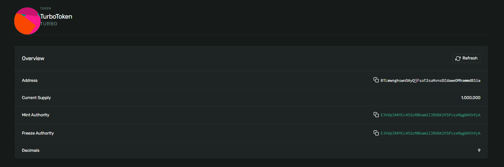

# TurboToken - SPL Token Mint

A creative SPL token implementation for the Turbin3 ecosystem on Solana Devnet.


## Token Details

- **Token Name:** TurboToken
- **Symbol:** TURBO
- **Decimals:** 9
- **Initial Supply:** 1,000,000 tokens


## Installation

```bash
bun install
```
Or with npm/yarn:
```bash
npm install
# or
yarn install
```

## Setup

1. **Get Devnet SOL** (if you don't have a wallet.json):
   ```bash
   solana-keygen new --outfile wallet.json
   solana airdrop 2 $(solana-keygen pubkey wallet.json) --url devnet
   ```

2. **Or use existing wallet:**
   Place your wallet keypair as `wallet.json` in this directory.

## Usage

Run the token mint creation script:

```bash
bun run mint
```

Or alternatively:
```bash
npm run mint
# or
bun run index.ts
```

## What It Does

1. ✅ Creates a new SPL token mint
2. ✅ Sets up token metadata (name, symbol)
3. ✅ Creates associated token account
4. ✅ Mints initial supply to your wallet
5. ✅ Saves all transaction details to `mint-info.json`

## Configurationd

To customize your token, edit `src/config.ts`:

```typescript
export const TOKEN_CONFIG = {
  name: "TurboToken",      // Your token name
  symbol: "TURBO",          // Your token symbol
  decimals: 9,              // Usually 9 for SPL tokens
  initialSupply: 1_000_000, // Initial supply
  // ...
};
```


```

### Mint Information

**Mint Address:** `BTLmwnghswnDAyQjFsoT2suHvnsDZdaweDMhammdB1ia`

**Associated Token Account:** `GkegT6kxbwdr7Uy1nVzCdbTk6YPC5pyHUSfvR9rtk5pq`

**Metadata Address:** `DkfoR5ijy7kdj2DmQYTWmM1hbLC9okcza9kBJDZHySwg`

### Transaction Signatures

1. **Mint Creation:**  
   `cHe2hPxETPrfsYayg3ghisbP5mCAvvnHxne8xXVamaKMKBaPYQZtgwcTBwkUVY3dEPGFVEPcrznhnQKptk4bp4P`

2. **Metadata Creation:**  
   `A9dcB2impRF96AehAFeMpxbWacNK6xdHzDiwe2upooma3vnv21DitD7huoFFNRCZXGMmL4jHhh75STdawE6FQhV`

3. **Token Minting:**  
   `57JpUQCFwt1M22e83BBuNyw6xDt7TA3xgomcg935QxBgqiJmvreHDKFjy69TJAG19D8b3SxyRC7U8DeKbReHjn9n`

### Explorer Links

**Token on Solana Explorer:**  
https://explorer.solana.com/address/BTLmwnghswnDAyQjFsoT2suHvnsDZdaweDMhammdB1ia?cluster=devnet

**Mint Creation Transaction:**  
https://explorer.solana.com/tx/cHe2hPxETPrfsYayg3ghisbP5mCAvvnHxne8xXVamaKMKBaPYQZtgwcTBwkUVY3dEPGFVEPcrznhnQKptk4bp4P?cluster=devnet

**Metadata Creation Transaction:**  
https://explorer.solana.com/tx/A9dcB2impRF96AehAFeMpxbWacNK6xdHzDiwe2upooma3vnv21DitD7huoFFNRCZXGMmL4jHhh75STdawE6FQhV?cluster=devnet

**Token Minting Transaction:**  
https://explorer.solana.com/tx/57JpUQCFwt1M22e83BBuNyw6xDt7TA3xgomcg935QxBgqiJmvreHDKFjy69TJAG19D8b3SxyRC7U8DeKbReHjn9n?cluster=devnet

```

## Screenshot



*Add a screenshot of the successful mint transaction from Solana Explorer here*
