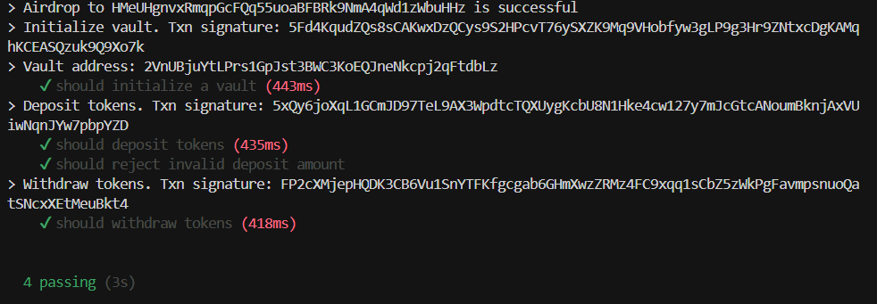

# Vault

**A secure vault for storing KIR tokens on Solana.**

a token vault system on Solana Devnet that stores KIR tokens towards a target amount. 


**Token Address:** [`6in59XC7jA4m5VYuYghR6uj5XoTGhGgAUNW2ufGwou1k`](https://solscan.io/token/6in59XC7jA4m5VYuYghR6uj5XoTGhGgAUNW2ufGwou1k?cluster=devnet)


## Screenshot




## Setup and Usage

1. Clone and install dependencies:

```bash
git clone https://github.com/
cd Task2/Vault
yarn install
```

2. Run the escrow program:

```bash
yarn execute
```

## Tests

```bash
anchor test
```

## Deployment

Ensure your environment is configured for Devnet in Anchor.toml:

```toml
[programs.devnet]
vault = "<YOUR_PROGRAM_ID>"

[provider]
cluster = "devnet"
wallet = "~/.config/solana/id.json"
```

> Ensure your local or devnet wallet is funded (via airdrop or manual transfer) before running any transactions.

Set Solana CLI to devnet and deploy the program:

```bash
solana config set --url devnet
anchor deploy
```


