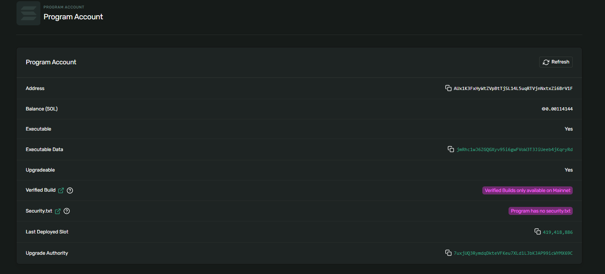
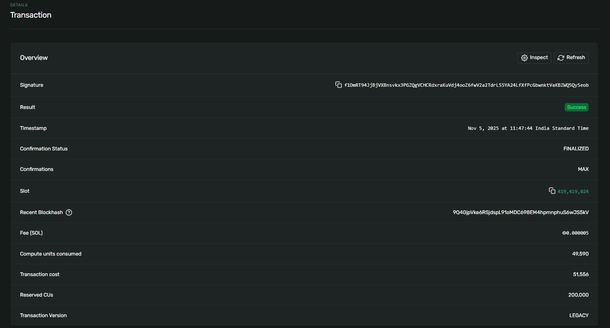
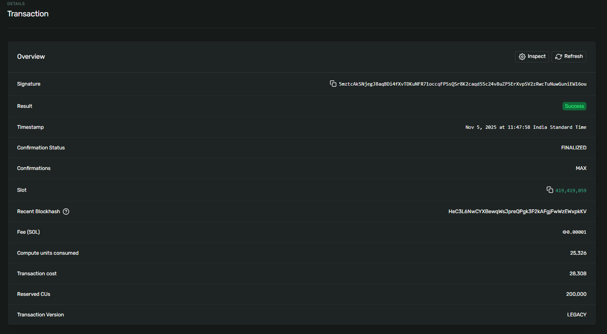
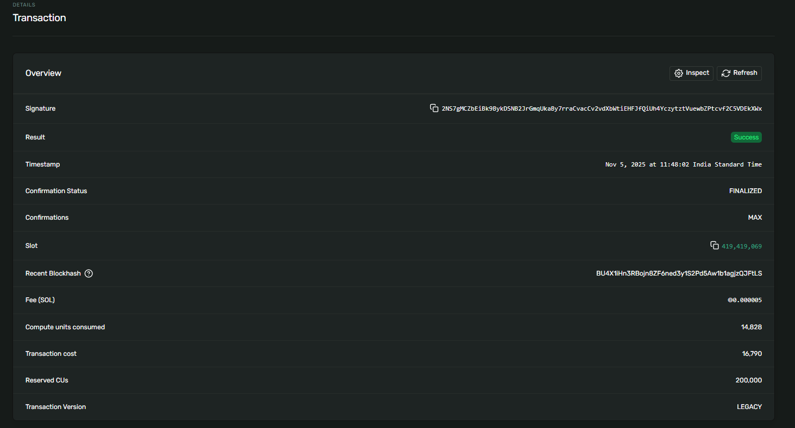
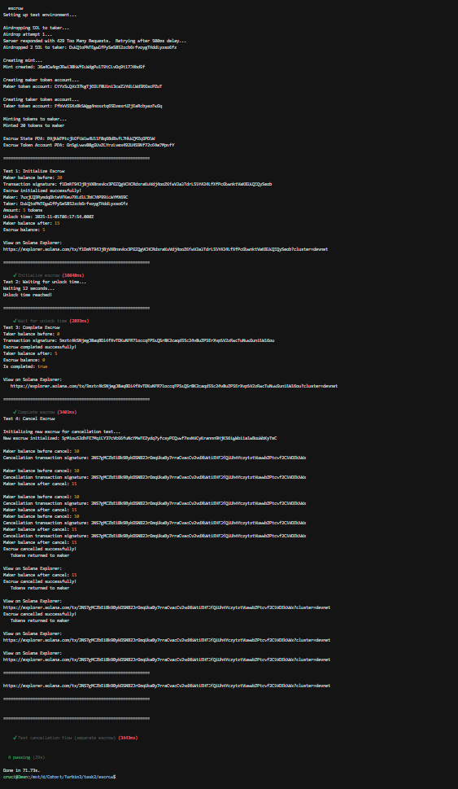

# Token Escrow Program

A secure time-locked escrow implementation using Anchor framework on Solana. This program enables trustless token transfers with time-based unlock conditions.

## Features

- ✅ Time-locked escrow for SPL tokens
- ✅ Maker deposits tokens with unlock conditions
- ✅ Taker can claim tokens after unlock time
- ✅ Maker can cancel before unlock time
- ✅ Secure PDA-based architecture
- ✅ Protection against double-completion

### Instructions

1. **Initialize**: Create an escrow with tokens and unlock time
2. **Complete**: Taker claims tokens after unlock time is reached
3. **Cancel**: Maker retrieves tokens back before unlock time
4. **Close**: Close the escrow account after completion/cancellation

### Accounts

- **EscrowState**: Stores escrow metadata (maker, taker, amount, unlock time, status)
- **EscrowTokenAccount**: Token account holding the escrowed tokens

## Installation

```bash
# Install dependencies
yarn install

# Build the program
anchor build

# Run tests
anchor test
```

## Deployment

### 1. Configure Solana CLI for Devnet

```bash
solana config set --url devnet
solana-keygen new --outfile ~/.config/solana/id.json
solana airdrop 2
```

### 2. Build and Deploy

```bash
# Build the program
anchor build

# Deploy to devnet
anchor deploy --provider.cluster devnet
```

### 3. Update Program ID

After deployment, update the program ID in:
- `Anchor.toml`
- `programs/escrow/src/lib.rs` (declare_id!)
- `tests/escrow.ts` (if needed)


## Program Details

**Program ID**: `AUx1K3FxHyWtZVpBtTjSL14L5uqRTVjnNxtxZi6BrV1F`

**Network**: Solana Devnet

**Test Mint:** `J6a4Cw4qpJRwi38hWfEcWdgPu1T9tCLvDq9t17JAbd9f`

**Escrow State PDA:** `BAjKWEMtcjbGftW1w4U11F8q6BdBsfL7HkWQMZqGPD5W`

**Escrow Token Account PDA:** `Gn5gLvwv88gGUvZCYrzLvex492U4S9Nf72vGAe3MpnfY`

### Transaction Signatures

1. **Initialize Escrow:**  
   `f1DmRT94JjBjVXBnsvkx3PGZQgVCHCRdxraKuVdj4ooZ6fwV2a2TdrL55YA24LfXfPcGbwnktVaKBZWQ5QySeob`

2. **Complete Escrow:**  
   `5mztcAkSNjegJ8aqBDi4fXvTDKuNFR71occqFPSsQSr8K2caqd55c24v8uZP5ErXvpSV2zRwcTuNuwGuniEW16ou`

3. **Cancel Escrow (Initialize):**  
   `5pMiou52dhFE3MqiCY37cVbG6fuNcYMeFEZydq7yfcsyPEQxwf7svNVCyKrannn9HjK56igWbiia1wBodWbKyTmC`

4. **Cancel Escrow (Cancel):**  
   `2NS7gMCZbEiBk9BykDSNB2JrGmqUkaBy7rraCvacCv2vdXbWtiEHFJfQiUh4YczytztVuewbZPtcvf2C5VDEkXWx`

### Explorer Links

**Program on Explorer:**  
https://explorer.solana.com/address/AUx1K3FxHyWtZVpBtTjSL14L5uqRTVjnNxtxZi6BrV1F?cluster=devnet

**Initialize Transaction:**  
https://explorer.solana.com/tx/f1DmRT94JjBjVXBnsvkx3PGZQgVCHCRdxraKuVdj4ooZ6fwV2a2TdrL55YA24LfXfPcGbwnktVaKBZWQ5QySeob?cluster=devnet

**Complete Transaction:**  
https://explorer.solana.com/tx/5mztcAkSNjegJ8aqBDi4fXvTDKuNFR71occqFPSsQSr8K2caqd55c24v8uZP5ErXvpSV2zRwcTuNuwGuniEW16ou?cluster=devnet

**Cancel Transaction:**  
https://explorer.solana.com/tx/2NS7gMCZbEiBk9BykDSNB2JrGmqUkaBy7rraCvacCv2vdXbWtiEHFJfQiUh4YczytztVuewbZPtcvf2C5VDEkXWx?cluster=devnet


## Screenshot

**Program on Explorer:**  



**Initialize Transaction:** 



**Complete Transaction:** 



**Cancel Transaction:**  



**Test:** 




---
