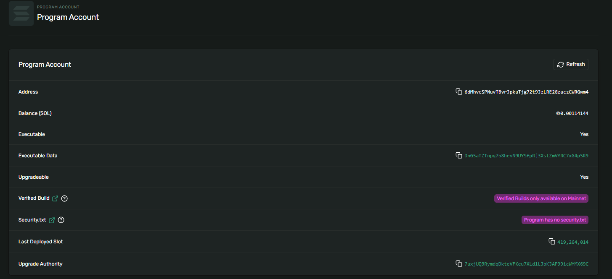
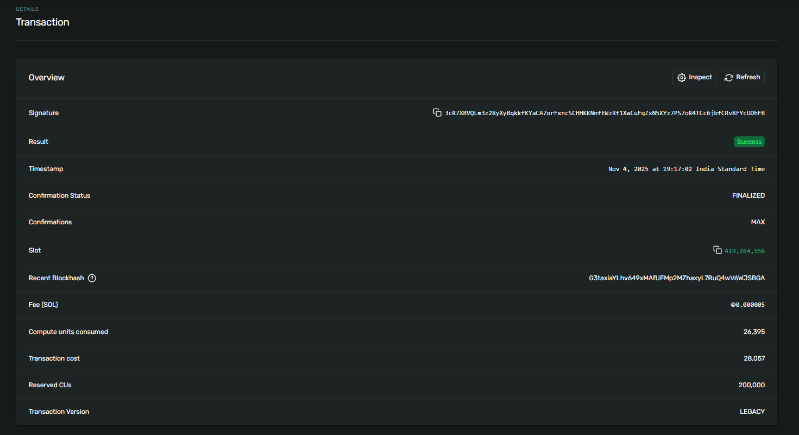
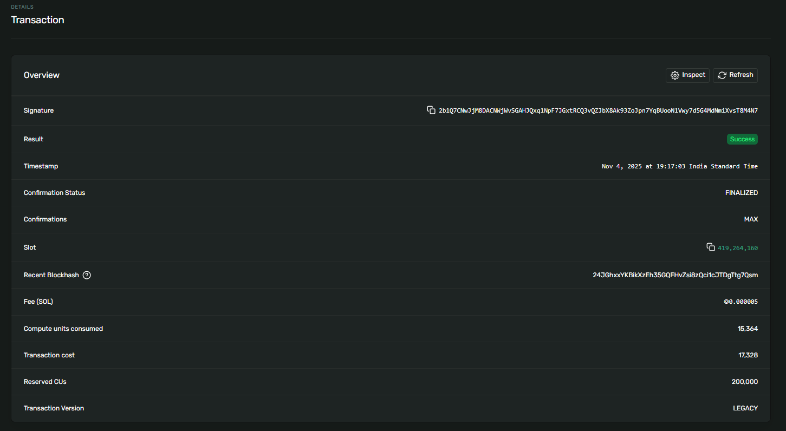
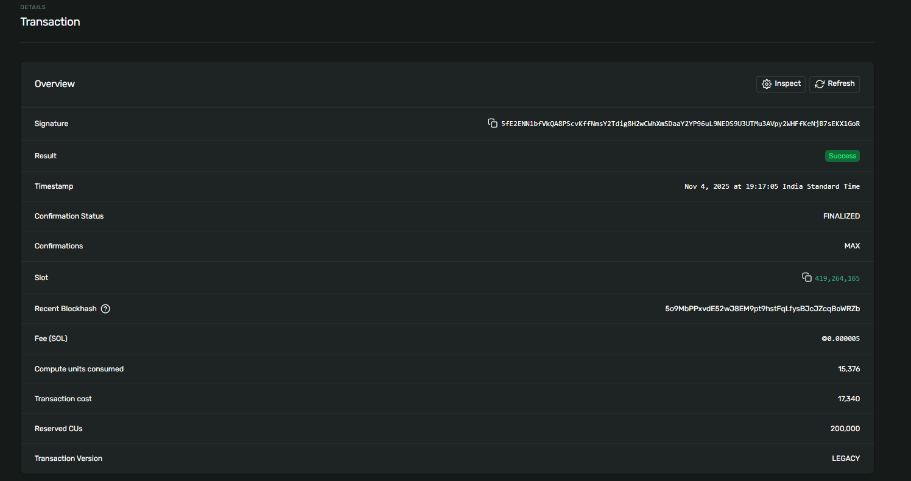

# Token Vault Program

A secure token vault implementation using Anchor framework on Solana. This program allows users to lock tokens in a vault and withdraw them later.

## Features

- ✅ Initialize a vault for any SPL token
- ✅ Deposit tokens into the vault
- ✅ Withdraw tokens from the vault
- ✅ Close vault when empty
- ✅ Secure PDA-based architecture

### Instructions

1. **Initialize**: Create a new vault for a specific token mint
2. **Deposit**: Lock tokens in the vault
3. **Withdraw**: Unlock and retrieve tokens from the vault
4. **Close**: Close the vault account (must be empty)

### Accounts

- **VaultState**: Stores vault metadata (owner, mint, total locked)
- **VaultTokenAccount**: Token account that holds the locked tokens


## Installation

```bash
# Install dependencies
yarn install

# Build the program
anchor build

# Run tests
anchor test
```

## Deployment

### 1. Configure Solana CLI for Devnet

```bash
solana config set --url devnet
solana-keygen new --outfile ~/.config/solana/id.json
solana airdrop 2
```

### 2. Build and Deploy

```bash
# Build the program
anchor build

# Deploy to devnet
anchor deploy --provider.cluster devnet
```

Run tests:
```bash
anchor test
```

## Program Details

**Program ID**: `6dMhvcSPNuvTBvrJpkuTjg72t9JzLRE2GzaczCWRGwm4`

### Deployment

**Deploy Signature:**  
`5NNBcfirozvabNGYWug7JipxWoWfDAwbQv1RAWGjiLpPdndvsgap7FggMaEQkPrxSoePNyorwo8fhwjHKSB5t3EP`

**Test Mint:** `AeQ4Se5Y3MLAA1hizzJrGRwzPiceQxDxVUMg6f9uhqZy`

**Vault State PDA:** `3XHeCbuDvvRqS36oPtLqJYrWDs66zmZT6HRcD8TEm8bc`

**Vault Token Account PDA:** `5YKmpHpMWLGaZtfBzp2H4axHdc6cUzBQ2iX7kTF7wozS`

### Transaction Signatures

1. **Initialize Vault:**  
   `3cR7XBVQLm3z28yXyBqkkfKYaCA7orFxncSCHHKKNnfEWzRf1XwCuFqZxN5XYz7PS7oR4TCc6jbfCRv8FYcUDhFB`

2. **Deposit Transaction:**  
   `2b1Q7CNwJjM8DACNWjWvSGAHJQxq1NpF7JGxtRCQ3vQZJbX8Ak93ZoJpn7YqBUooN1Vwy7d5G4MdNmiXvsT8M4N7`

3. **Withdraw Transaction:**  
   `5fE2ENN1bfVkQA8PScvKffNmsY2Tdig8H2wCWhXmSDaaY2YP96uL9NEDS9U3UTMu3AVpy2WHFfKeNjB7sEKX1GoR`

4. **Withdraw Remaining:**  
   `2WPMgBwTEbJFUBdQDfcjkXY9G7PBdMhtSuWFa3QUHzgDKhbrAjgg56hr4ruFfp2hKAujjnrtA6xWmNv7689Pq3oz`

### Explorer Links

**Program on Explorer:**  
https://explorer.solana.com/address/6dMhvcSPNuvTBvrJpkuTjg72t9JzLRE2GzaczCWRGwm4?cluster=devnet

**Initialize Transaction:**  
https://explorer.solana.com/tx/3cR7XBVQLm3z28yXyBqkkfKYaCA7orFxncSCHHKKNnfEWzRf1XwCuFqZxN5XYz7PS7oR4TCc6jbfCRv8FYcUDhFB?cluster=devnet

**Deposit Transaction:**  
https://explorer.solana.com/tx/2b1Q7CNwJjM8DACNWjWvSGAHJQxq1NpF7JGxtRCQ3vQZJbX8Ak93ZoJpn7YqBUooN1Vwy7d5G4MdNmiXvsT8M4N7?cluster=devnet

**Withdraw Transaction:**  
https://explorer.solana.com/tx/5fE2ENN1bfVkQA8PScvKffNmsY2Tdig8H2wCWhXmSDaaY2YP96uL9NEDS9U3UTMu3AVpy2WHFfKeNjB7sEKX1GoR?cluster=devnet


## Screenshot

**Program** 

**Initialize Transaction:**

**Deposit Transaction:**

**Withdraw Transaction:** 



---


